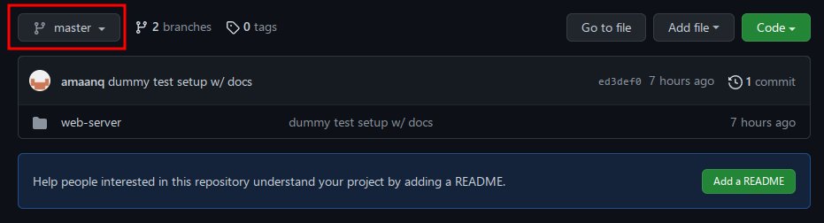
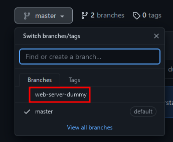
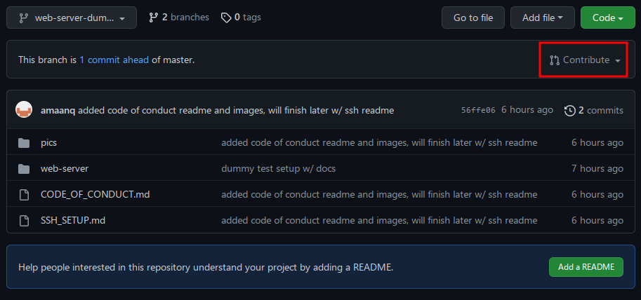
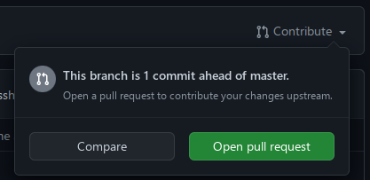
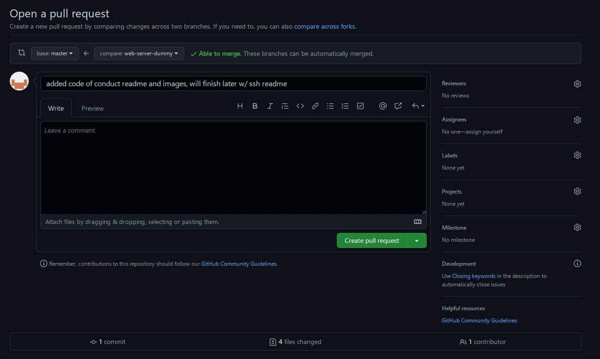

# Code of Conduct

## Rules that are expected to be followed by any contributor in this repository

* Participate in an authentic and active way. In doing so, you contribute to the
health and longevity of this community.
* Exercise consideration and respect in your speech and actions.
* Attempt collaboration before conflict.
* Refrain from demeaning, discriminatory, or harassing behavior and speech.
* Be mindful of your surroundings and of your fellow participants. Alert community
leaders if you notice a dangerous situation, someone in distress, or violations of
this Code of Conduct, even if they seem inconsequential.

## Basic Git Guide: how to use git, good practices, and what not to do  

### Cloning

For starters, if you're an absolute beginner to git then cloning is the first technique
you should learn if you don't already know it.

Cloning will take a repo and save it locally to your drive in a folder of the
repository name in the working directory you initiated the command

To clone this project, run:

```sh
git clone git@github.com:NeRF-or-Nothing/vidtonerf.git
```

If you receive an error, then you might not have an SSH key linked to your GitHub
account. For now you can use https, or you can head over to the [SSH Setup Guide](./SSH_SETUP.md).

```sh
git clone https://github.com/NeRF-or-Nothing/vidtonerf.git
```


 *Images for reference on how to find the URL to clone for this and any projects:
 (select the HTTPS tab if you don't have ssh setup)*

### **Contributing**

Git works by having a master branch where the "actual" code is.

You can think of a branch as a timeline of its own where master is the actual
timeline, and other branches are "alternative" timelines where some small changes
might've happened.

In our project, we would ideally like each group to have their own branch to work
on, so that we don't cause conflict issues or other problems where someone might
accidentally delete a file.

If a team believes they made changes that are solid and can be "deployed" in a testable
manner that is successful, they can then "ask" to merge their branch into master.

This act of "asking" to merge is called creating a pull request. Someone then has
to approve the pull request and all changes made are then merged into master. Ideally
you don't want to approve your own merge.

### Branches

You can view branches by running the following command in the project directory:

```sh
git branch
```

Example output (the asterisk denotes what branch you're currently on):

```sh
* master
  web-server-dummy
(END)
```

*Note that this will use a pager (depending on your OS/setup) in case the list is
long, so hit q to exit the view (this is the default for most pagers)*

### Creating a branch

To create a new branch for you and your team to work on, or whatever it may be,
the syntax is as follows:

```sh
git checkout -b <branch-name>
```

*The -b flag means to create a new branch, otherwise you'll just
checkout an existing branch (if it exists)*

### Adding files (and committing)

Git does not automatically add your changes to your branch, you have to do it manually.

First you add files you want to later commit. Generally you would be in your
project directory, and you would run the following command:

```sh
git add <file-name>
```

For a catch-all case where any non-ignored files are added, you can run the
following command:

```sh
git add .
```

*This is highly advised against due to how easy it is to add bloat to commits
and repositories, like images, binaries, and other large files*

Adding effectively stages files **to be** committed, i.e. the next time you commit
only the files added with ```git add``` will be committed.

Now to commit these changes (locally), you would run the following command:

```sh
git commit -m "message"
```

It is a good practice to not have a meaningless or overly long commit message.

Remember, short and sweet, get to the point with what you did.

```sh
git commit -m "changes" # This is terrible
```

```sh
git commit -m "updated the README and commented main.py" # This is much better
```

Lastly, to push these changes to the remote git repository (like GitHub) you'd
run the following command:

```sh
git push origin <branch-name>
```

This will push the changes to the remote repository.

**Note: you will already have a remote that points to the remote repository
(first argument), and the branch you want to push the locally updated version
(second argument).**

To view your remotes, run:

```sh
git remote -v
```

You might be asking, why do I already have an origin remote? Well, when cloning
a repository, your local cloned repository has a "remote" that points to the remote
repository, which is often called "origin" or "upstream" (main branch of a fork).

For anyone interested, if you create a new directory that you plan to put on a
remote Git repository later, you can create a remote that points to the remote
repository by running the following command:

```sh
git remote add origin <remote-repository-url>
```

Then you can push to this remote, which will sync the changes to the remote repository.

## Pull Requests

As briefly mentioned earlier, if you're working on your own branch and think you've
made sufficient progress to have your changes merged into the production/master branch,
you can ask to merge by creating a pull request. This can be done on GitHub
quite easily with images shown below:



*Then you want to click on the branch you're working on,
which in my case is "web-server-dummy"*





*Notice the "Contribute" button? Click it!*



*Click "Open Pull Request"*



Okay, hopefully you've figured out how to get to this point.

If so, you can scroll down to see all the changes you've made compared to the
master branch.

Your title should include a summary of changes since you last merged your branch
into master. (By default the title is your last commit message)

The description should go a bit more in depth about your changes and why you
believe it should be merged.

Once done, just click "Create Pull Request" and you're done!

**You now have a brief overview and understanding of Git, congrats!**

**If you're unsure about anything and/or have questions please consult either
Amaan or Eric.**
