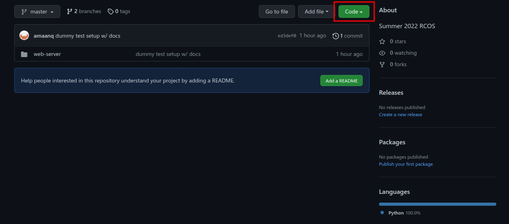
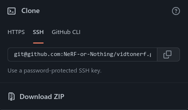

# Some general overview and rules are the bare minimum to be expected from any contributor in this repository.

* ### Participate in an authentic and active way. In doing so, you contribute to the health and longevity of this community.
* ### Exercise consideration and respect in your speech and actions.
* ### Attempt collaboration before conflict.
* ### Refrain from demeaning, discriminatory, or harassing behavior and speech.
</br>

# This page is mainly to do with git, such as how to use git, good practices and what not to do.

## **Cloning**
### For starters, if you're completely new to git then cloning is likely the first thing you should learn (or already know)
</br>

### Cloning will take a repo and save it locally to your drive in a folder of the repo name in the working directory you initiated the command
### To clone this project, run 
### ```git clone git@github.com:NeRF-or-Nothing/vidtonerf.git```
### If it errors out, then you don't have an ssh key linked to your GitHub account. For now you can just use https, or you can head over to the [SSH Setup Guide](./SSH_SETUP.md).
### ```git clone https://github.com/NeRF-or-Nothing/vidtonerf.git```
[] 
[]
### *Images for reference on how to find the URL to clone for this and any projects: (select the HTTPS tab if you don't have ssh setup)*
</br>

## **Contributing**
### Git works by having a master branch where the "actual" code is.
### You can think of a branch as a timeline of its own where master is the actual timeline, and other branches are "alternative" timelines where some small changes might've happened.
### In our project, we would ideally like each group to have their own branch to work on, so that we don't cause conflict issues or other problems where someone might accidentally delete a file.
### If a team believes they made changes that are solid and can be "deployed" in a testable manner that is successful, they can then "ask" to merge their branch into master.
### This act of "asking" to merge is called creating a pull request. Someone then has to approve the pull request and all changes made are then merged into master. Ideally you don't want to approve your own merge.
</br>

## Branches 
### At the time of writing, there are currently two branches. You can view this by running the following command in the project directory.
### ```git branch```
### Output from my viewpoint (the asterisk denotes what branch you're currently on): 
```
* master
  web-server-dummy
(END)
```
*Note that this uses a vim-like interface, so hit q to exit this view*

## Creating a branch
### To create a new branch for you and your team to work on, or whatever it may be, the syntax is as follows:
### ```git checkout -b <branch-name>```
*the -b flag means to create a new one, otherwise without it you'll just change to an existing branch (if it exists)*
</br>

## Adding files (and committing)
### Git does not automatically add your changes to your branch, you have to do it manually.
### First you add files you want to later commit. Generally you would be in your project directory, and you would run the following command:
### ```git add <file-name>```
### For a catch-all case where any non-ignored files are added, you can run the following command:
### ```git add .```
</br>

### Now to commit these changes (locally), you would run the following command:
### ```git commit -m "message"```
### It is good practice to not have a meaningless or overly long commit message.
### Short and sweet, get to the point with what you did
### ```git commit -m "changes"``` is terrible
### ```git commit -m "updated the README and commented main.py"``` is much better
</br>

### Lastly, to push these changes to the remote git repository (like GitHub) you would run the following command:
### ```git push origin <branch-name>```
### This will push the changes to the remote repository.
### Note: you will have a remote that **points** to the remote repository (first argument), and the branch you want to push the locally updated version(second argument). 
