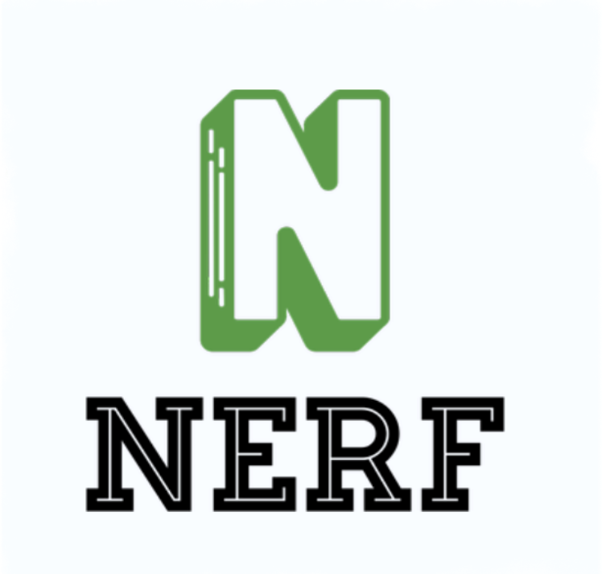
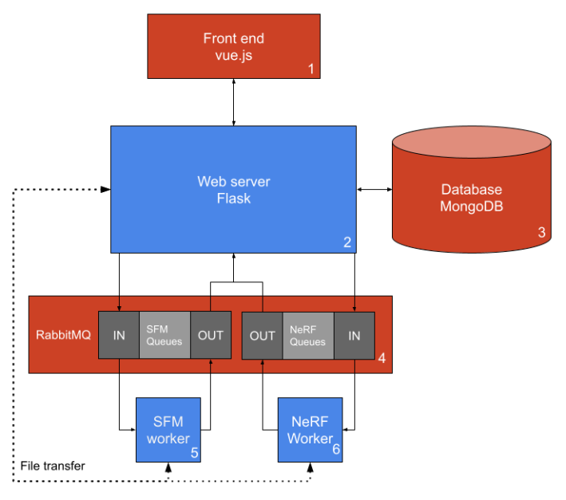
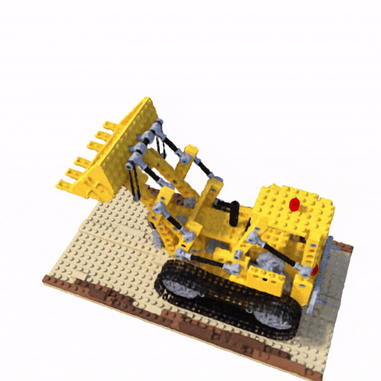

<!-- ReadMe template based on https://github.com/othneildrew/Best-README-Template -->

[![Contributors][contributors-shield]][contributors-url]
[![Forks][forks-shield]][forks-url]
[![Issues][issues-shield]][issues-url]
[![MIT License][license-shield]][license-url]

<!-- PROJECT LOGO -->
 

  

<h3 align="center">NeRF or Nothing central repo</h3>

  

    A micro-services based project in rendering novel perspectives of input videos utilizing neural radiance fields.
     
    <a href="https://github.com/NeRF-or-Nothing/vidtonerf/wiki/Learning-Resources"><strong>Learn more about NeRFs »</strong></a>
     
     
    <a href="https://github.com/NeRF-or-Nothing/vidtonerf">View Demo</a>
    ·
    <a href="https://github.com/NeRF-or-Nothing/vidtonerf/issues">Report Bug</a>
    ·
    <a href="https://github.com/NeRF-or-Nothing/vidtonerf/issues">Request Feature</a>
  

## About The Project
This repository contains the backend for the NeRf (Neural Radiance Fields) or Nothing web application that takes raw user video and renders a novel realistic view of the scene they captured. Neural Radiance Fields are a new technique in novel view synthesis that has recently reached state of the art results. 

### Some Important Background About NeRFs
NeRFs operate by first taking sets of input images taken at known locations and projecting rays from each input image via a pinhole camera model projection into 3D space. Assuming the input images are all capturing different perspectives of the same scene these reprojected rays will intersect in the center of the scene forming a field of light rays that produce the input images (these are the initial radiance fields). Then a small neural network is trained to predict the intensities and colors of light along this intersecting region in order to model the radiance fields that must have produced the initial images. This neural network is initialized randomly for each new scene and trained uniquely to model each captured scene. When the training is over a neural network is trained that can predict the color and intensity of a ray when polled at a specific angle and location in the scene. Using this trained neural network, raytracing can be used to poll the neural network along all the rays pointing towards a new virtual camera to take a picture from the scene at a perspective never seen before. Important to this project is the fact that the locations for each image are needed in order to train a NeRF, we get this data from running structure from motion (using COLMAP) on the input video. To learn more please visit the learning resources in the wiki.

### General Pipeline:
1. Run Structure from motion on input video (using COLMAP implementation) to localize the camera position in 3D space for each input frame
2. Convert the structure from motion data to Normalized Device Coordinates NDC 
3. Train the NeRF (implemented with TensoRF) on the input frames and their corresponding NDC coordinates
4. Render a new virtual "flythrough" of the scene using the trained NeRF

### Project Structure

Since running COLMAP and TensoRF takes upwards of 30 minutes per input video, this project utilizes RabbitMQ to queue work orders for asynchronous workers to complete user requests. MongoDb is used to keep track of active and past user jobs. The worker implementations are under the `NeRF`, and `colmap` folders respectively while the central webserver is under `web-server`. For more information on how these components communicate and how data is formatted see the READMEs within each of the aforementioned folders.
## Getting Started
To run the project install and run the web-server, the nerf worker, and the colmap worker in any order by running their respective installations in their READMEs. Once these are running the front-end can be started by visiting the [front end repo](https://github.com/NeRF-or-Nothing/web-app). Once everything is running the website should be available at `localhost:3000` and a video can be uploaded to test the application.

### Prerequisites
1. Have [Docker](https://www.docker.com/) installed locally
NOTE: The Docker container comes preloaded with ffmpeg and colmap. If you wish to run this outside of the docker environment you would have to install these locally.
2. If you intend to run the NeRF and COLMAP workers locally ensure you have NVIDIA GPUS with atleast 6GB of vram as these are resource intensive applications
## Output Example 
Converting the training images from the [nerf-synthetic](https://drive.google.com/drive/folders/1JDdLGDruGNXWnM1eqY1FNL9PlStjaKWi) dataset lego example to a video then running vidtonerf produces the following result:

## Roadmap
TODO

## Contributing

Contributions are what make the open source community such an amazing place to learn, inspire, and create. Any contributions you make are **greatly appreciated**.

If you have a suggestion that would make this better, please fork the repo and create a pull request.

1. Fork the Project
2. Create your Feature Branch (`git checkout -b feature/AmazingFeature`)
3. Commit your Changes (`git commit -m 'Add some AmazingFeature'`)
4. Push to the Branch (`git push origin feature/AmazingFeature`)
5. Open a Pull Request

<!-- LICENSE -->
## License

Distributed under the MIT License. See `LICENSE` for more information.

## Contact

Interested in the project?  
Come join our [discord server](https://discord.gg/mpcJR4FvND)!  
Or inquire at: `nerf@quicktechtime.com`

## Acknowledgments

* [TensoRF project](https://github.com/apchenstu/TensoRF)
* [Original NeRF](https://github.com/bmild/nerf)
* [COLMAP ](https://colmap.github.io/)

<!-- MARKDOWN LINKS & IMAGES -->
<!-- https://www.markdownguide.org/basic-syntax/#reference-style-links -->
[contributors-shield]: https://img.shields.io/github/contributors/NeRF-or-Nothing/vidtonerf.svg?style=for-the-badge
[contributors-url]: https://github.com/NeRF-or-Nothing/vidtonerf/graphs/contributors
[forks-shield]: https://img.shields.io/github/forks/NeRF-or-Nothing/vidtonerf.svg?style=for-the-badge
[forks-url]: https://github.com/NeRF-or-Nothing/vidtonerf/network/members
[stars-shield]: https://img.shields.io/github/stars/NeRF-or-Nothing/vidtonerf.svg?style=for-the-badge
[stars-url]: https://github.com/NeRF-or-Nothing/vidtonerf/stargazers
[issues-shield]: https://img.shields.io/github/issues/NeRF-or-Nothing/vidtonerf.svg?style=for-the-badge
[issues-url]: https://github.com/NeRF-or-Nothing/vidtonerf/issues
[license-shield]: https://img.shields.io/github/license/NeRF-or-Nothing/vidtonerf.svg?style=for-the-badge
[license-url]: https://github.com/NeRF-or-Nothing/vidtonerf/blob/master/LICENSE.txt
[linkedin-shield]: https://img.shields.io/badge/-LinkedIn-black.svg?style=for-the-badge&logo=linkedin&colorB=555
[linkedin-url]: https://linkedin.com/in/linkedin_username
[product-screenshot]: images/screenshot.png
[Next.js]: https://img.shields.io/badge/next.js-000000?style=for-the-badge&logo=nextdotjs&logoColor=white
[Next-url]: https://nextjs.org/
[React.js]: https://img.shields.io/badge/React-20232A?style=for-the-badge&logo=react&logoColor=61DAFB
[React-url]: https://reactjs.org/
[Vue.js]: https://img.shields.io/badge/Vue.js-35495E?style=for-the-badge&logo=vuedotjs&logoColor=4FC08D
[Vue-url]: https://vuejs.org/
[Angular.io]: https://img.shields.io/badge/Angular-DD0031?style=for-the-badge&logo=angular&logoColor=white
[Angular-url]: https://angular.io/
[Svelte.dev]: https://img.shields.io/badge/Svelte-4A4A55?style=for-the-badge&logo=svelte&logoColor=FF3E00
[Svelte-url]: https://svelte.dev/
[Laravel.com]: https://img.shields.io/badge/Laravel-FF2D20?style=for-the-badge&logo=laravel&logoColor=white
[Laravel-url]: https://laravel.com
[Bootstrap.com]: https://img.shields.io/badge/Bootstrap-563D7C?style=for-the-badge&logo=bootstrap&logoColor=white
[Bootstrap-url]: https://getbootstrap.com
[JQuery.com]: https://img.shields.io/badge/jQuery-0769AD?style=for-the-badge&logo=jquery&logoColor=white
[JQuery-url]: https://jquery.com