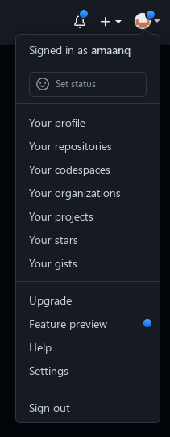

# SSH Setup for GitHub

## Firstly, what is SSH?
### SSH, or Secure Shell, is a protocol that allows you to securely connect to a remote computer.
### This allows you to do anything to a remote machine without anyone being able to peer into what you're doing since the data transferred is encrypted.
</br>

## Now, why does GitHub use SSH?
### The main reason is to have secure access to the remote repository, i.e. any commits, pull requests, etc. made are secure.
### Another reason is that with HTTPS, you have to supply your username and password as well as a personal access token, which is somewhat a pain and nuisance, not to mention the security flaws of using HTTPS on a public network.
</br>

## Okay, makes sense, how do I get started with SSH?
### First, you need to have a public key on your computer.
### Unix-like systems have a command called "ssh-keygen" that will generate a public key for you. (This includes MacOS)
### MacOS, if SSH is disabled which might be the case, check out this [article](https://jumpcloud.com/blog/how-to-enable-ssh-mac)
### Windows, please refer to this [documentation](https://docs.microsoft.com/en-us/windows-server/administration/openssh/openssh_install_firstuse)
### Linux/BSD alphas, you should already have it preinstalled, but if not you can Google how to as it's distro-specific.

## ssh-keygen
### So, we want to generate a key that we can use to let GitHub know we are who we are.
### We can do this by running the following command:

```sh
ssh-keygen -t ed25519 -C "your_github_email@example.com"
```

### You'll be asked where to save the file, like so:


### **Quick Note: REMEMBER THIS PATH! You'll need it later**
### Just hit enter to use the default, if it asks you to overwrite an existing key and you're unfamiliar with SSH, you can go ahead and overwrite it.
</br>

### You should now be asked to enter a passphrase.
### This is pretty important since it's how GitHub knows that you are who you say you are.
### **Do NOT use an empty passphrase**

### If you're successful, your output should look roughly like mine:


</br>

## Adding your key to GitHub
### Now that we have our key, we need to add it to GitHub so we can push to our repo without a hassle.
### Navigate to [GitHub](https://github.com) and click on the drop down menu by your profile picture in the top right corner.



*Go to Settings, then "SSH and GPG keys" on the left side.*


*Now hit "New SSH Key" at the top.*


### Your title should be something easy to recognize what machine and environment it's tied to, like the picture above where I have my laptops, desktop, and home server named.
### Now comes the tricky part, getting your public key. Remember when I said to remember the path when you created your key? Well that's the file path to your private key, and the public key is the same but ends with ".pub".
### For Unix-like systems (Linux, BSD, MacOS), you can use the following command to get your public key (if my private key were at ~/.ssh/id_ed25519):
```sh
cat ~/.ssh/id_ed25519.pub # remember the public key ends in .pub
```
### For Windows, you can try navigating to the folder where your private key is located, but you might have to enable the "Show hidden files" option in Explorer and "Show file extensions" in the View menu.
### Once you have your public key (which should start with ssh-ed25519 and end with your email), paste it into the key box.
### Finally, hit "Add SSH Key"
</br>

## Now you've created an SSH Key and added it to GitHub, how do I push to GitHub?
### You can see if just pushing to an SSH remote branch prompts you for a passphrase, which is the same passphrase you used to generate your key.
### If not, then you have to start an ssh-agent each time you login to your machine, which can be a bit annoying
### Unix-like systems can utilize a tool I use called "Keychain" which automatically launches on start and will prompt you for the passphrase once, then never ask it again when pushing. Convenient, right?
</br>

# Keychain setup (totally optional but makes life easier)
## **Installation**

## Debian-based (Ubuntu, Debian, etc.):
```sh
sudo apt install keychain
```

## Arch-based (Arch, Manjaro, etc.):
```sh
sudo pacman -S keychain
```

## MacOS:
```sh
brew install keychain
```

## **Setup**

## Linux:
### You need to edit your ~/.bashrc (or ~/.zshrc if you use ZSH, etc..) file to add the following line:
```sh
eval `keychain --eval --agents ssh id_ed25519`
```

## MacOS:
### You need to edit your ~/.bash_profile file to add the following line:
```sh
eval `keychain --eval --agents ssh --inherit any id_ed25519`
```

### Save and exit, then restart your terminal.
### You should see some output like mine...or if not it prompts you for your SSH Key's passphrase then looks like mine.

</br>

# Hopefully SSH seems less daunting, and now you can get back to work with a bit more confidence and ease.