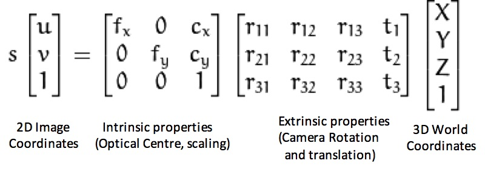
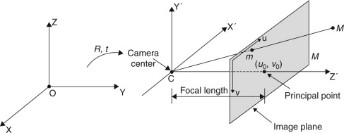

### COLMAP
COLMAP is a general-purpose Structure-from-Motion (SfM) and Multi-View Stereo (MVS) pipeline
that is used for estimating three-dimensional structures from two-dimensional image
sequences. The process of the reconstruction process includes the following:
- Data Collection → Images collected by user
- Extraction of Image Features → Extract eigenvalues from the image
- Feature Point Matching → Matches corresponding points between images
- Sparse Reconstruction (SfM) → Restore the three-dimensional structure of the scene and camera attitude
- Depth Map Estimation → Restore the depth information of the reference image
- Dense Reconstruction (MVS) → Obtain camera pose and calculate 3D points corresponding to each pixel in the image

This project will be using the image and camera data output from COLMAP and
implementing it to the NeRF. To achieve this, COLMAP will be run from command line using colmap_runner.py. Then using the generate output of each images, process the data using image_position_extractor.py to extract the quaternion and transpose vector. Finally, feed the data to matrix.py that converts the data to intrinsic and extrinsic matrices to be used by NeRF.

### Data Processing

Image list with two lines of data per image:
IMAGE_ID, QW, QX, QY, QZ, TX, TY, TZ, CAMERA_ID, NAME\
POINTS2D[ ] as (X, Y, POINT3D_ID)

Quaternion: QW, QX, QY, QZ\
Transpose Vector: TX, TY, TZ

-r^t * T = coordinate of project/camera center
- r^t = inverse/transpose of the 3x3 rotation matrix composed from the quaternion
- T = translation vector

The quaternion elements will first be converted to a rotational matrix. Then, the coordinate of the images' camera center can be computed by taking the inverse of this rotational matrix multiplied by the translation vector. This is essentially the extrinsic matrix that describes the camera's location in the world, and what direction it's pointing.

Quaternion can also be used to calculate the Euler angles which contains the roll, pitch, and yaw of the three rotational axes.
- Roll is rotation around x in radians (counterclockwise)
- Pitch is rotation around y in radians (counterclockwise)
- Yaw is rotation around z in radians (counterclockwise)

**Projection Matrix**
- Each 2D image coordinates have intrinsic and extrinsic properties that can describe the 3D world coordinates. The intrinsic matrix is mainly used to scale and calibrate the optical center while the extrinsic properties contains the rotation and translation to project an image to the 3D world view.

Source:https://www.cc.gatech.edu/classes/AY2016/cs4476_fall/results/proj3/html/agartia3/index.html

**Projection Diagram**
- The image below a pinhole camera model that is used in this project. The real-word coordinates X, Y and Z of point P is used to calculate the image coordinates X' and Y' of the point P′ projected onto the image plane using the focal length.

Source: https://www.sciencedirect.com/topics/engineering/intrinsic-parameter

### Good Data Collection Tips
- Try to take pictures/videos in a clean background that is not messy
- Take structure in an environment that has opposing color to the structure itself
- Take a decent amount of pictures that covers a wide range of position
- Try to take images with the same angles among an axis

### Script Usage
- colmap_runner.py → run colmap from command line
- image_position_extractor.py → used in matrix.py to extract colmap output
- matrix.py → outputs json object of intrinsic and extrinsic matrix
- main.py → starts worker to process requests automatically from the web-server (start the web-server before running)

### Running COLMAP Locally
- Update default config in 'colmap/configs/default.txt' with data from 'colmap/configs/local.txt' 
- Update the input_data_path parameter in colmap/configs/local.txt to point to the mp4 file
- run: docker compose up sfm-worker
  
### Reference for Additional Research
- COLMAP Installation\
https://colmap.github.io/install.html
- COLMAP Data Output Format\
https://colmap.github.io/format.html
- Quaternion to Rotational Matrix\
https://www.euclideanspace.com/maths/geometry/rotations/conversions/quaternionToMatrix/index.htm
- Quaternion to Euler Angle\
https://en.wikipedia.org/wiki/Conversion_between_quaternions_and_Euler_angles
- Extrinsic Matrix\
https://ksimek.github.io/2012/08/22/extrinsic/

