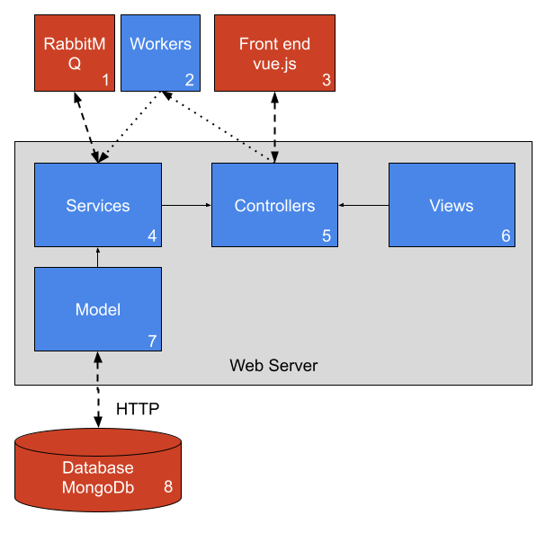

# Web-Server

This flask based webserver coordinates with the workers using RabbitMQ to send jobs to async workers process user videos.

## Description
The webserver is based on a model view controller architecture with an additional services layer on top of the model. Following the MVC design patter the controller defines the API and takes user requests from the front end. The controller then utilizes the services and views to generate it's response to the user. The model is the python interface with mongoDB and the View (not implemented yet) contains rendering templates to return the to the user. The services layer is where the majority of the logic is held and has a synchronous portion responsible for publishing  work requests to the asynchronous workers and an asynchronous portion responsible to listening to the output queues to receive data from the workers when they are complete.
### Web-server Structure



### Local File structure
When running the web-server a local file structure should be created to match the following layout. This is where the server will store all images, videos, and non text based data.
```
├── data
|	├── raw       		
|	|	|── videos 			
│	├── sfm        		
|	|	|── JOBID 			
|	|		|──imgs			
│	├── nerf 
│  	|	|── JOBID

```
### DB structure
All the data in mongodb is in a single collection labeled scenes. A scene represents a single request from the user to render a scene and contains the following data:

Scene:
```
{
    "id":str,
    "status":int,
    "video": <Video>,
    "sfm": <Sfm>,
    "nerf": <Nerf>
}
```

Video:
```
{
    "file_path": str,
    "width": int,
    "height": int
}
```
Frame:
```
{
    "file_path": str,
    "extrinsic_matrix": [[float]]
}
```
Sfm:
```
{
    "intrinsic_matrix": [[float]],
    "frames": [<Frame>]
}
```

Nerf:
```
{
    "model_file_path":str,
    "rendered_video_path":str
}
```

### RabbitMQ
RabbitMQ is used to send job requests and final products to and from the web-server to seperate worker processes. This is achieved through 4 queues, nerf-in, nerf-out, sfm-in, sfm-out. Instead of serializing data and sending large files over RabbitMQ everything published to the que will provide URIs to access non text data like videos and images so the other end of the queue can pull the data when needed. On the web-server this happens on two asynchronous threads that listen on sfm-out and nerf-out respectively waiting for jobs to finish before accessing the final product through the URI's provided by the workers and saving it to the local database (MongoDb).

Note: There will be a delay the first time the services are started. RabbitMQ will keep retrying the connection until the program either connects or two minutes have elapsed. If the connection takes longer than two minutes to complete, then the program will shut down and raise an exception detailing what function the connection was taking too long to complete. There are three functions in the program that are trying to connect to the services, see [services/queue_service.py](./services/queue_service.py), `_init_, digest_finished_sfms, digest_finished_nerfs`.
## Getting Started

### Dependencies

* Docker to automate the installation of MongoDb and RabbitMQ
* Python to run the flask server and any package in requirements.txt

### Installing

* Start by running the docker-compose file with the command `docker-compose up `. This will install the RabbitMQ and MongoDb servers needed to run the webserver and exposes them on their default ports
* Next install the Python dependencies using the requirements.txt with the command `pip install -r requirements.txt`


### Executing program
* Run `docker compose up -d` to start MongoDb and RabbitMQ
* Run `python main.py` to start the webserver


## Help
* Currently there is an issue with Pika (RabbitMQ client) timing out, if this occurs restart the webserver to continue using the application.
